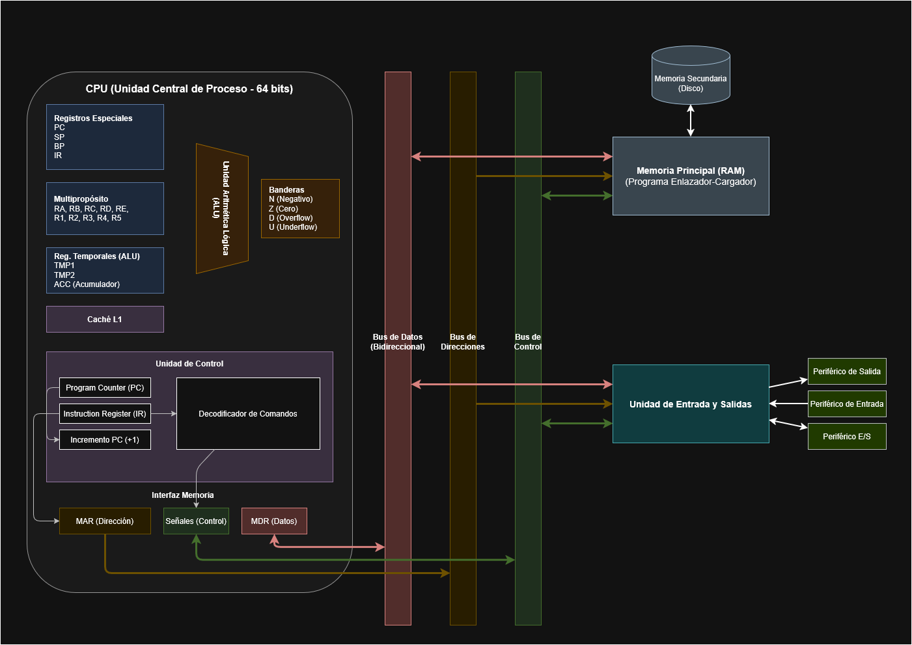

# Emulación de su computador

## Grupo

* Juan David Castañeda Cardenas
* Nicolas Pajaro Sanchez
* Brayan Alejandro Muñoz Perez
* Alvaro Andres Romero Castro
* Nicolas Rodriguez Piraban
* Carlos Eduardo Jimenez Gonzales 

## Enunciado

1. Implemente, en algún lenguaje de programación de alto nivel, el computador diseñado por Usted
en la Tarea 9.

2. La aplicación debe permitir (de forma simple) escribir directamente sobre los bits de la memoria
RAM (o cargar desde un archivo, es decir debe tenerse implementado el submódulo “Cargador”)
(en cualquier posición o bit) de la máquina propuesta el código binario que se desee (en particular:
Programas en código binario y datos) y, con el programa binario en memoria, debe poder correrse
bien sea paso a paso o bien completo (que ejecute automáticamente todas las instrucciones hasta
encontrar la instrucción de parar).

3. Usar como ejemplos de pruebas al menos los mismos que se usaron en las pruebas de los diseños
de la referida tarea donde se presentan los diseños del computador propuesto.

## Archivos

* Ambiente
* CPU
* ALU 
* Ram
* Registros
* Cargador

## Diseño

## Funcionamiento ensamblador

El ensamblador toma un archivo escrito en assembly para esta máquina (generalmente terminado en .asm) y resulta en un archivo objeto (terminado en .o), que codifica las instrucciones y simbolos usados en el archivo original.

### Lenguaje assembly

El lenguaje en su forma más basica transforma las instrucciones directamente al binario que puede ejecutar la máquina. Pero hay algunas abstracciones para ayudar al programador.

#### Secciones:

El lenguaje cuenta con dos secciones, una donde van las instrucciones ejecutables (text:) y otra que contiene datos para ser usados en la seccion text (data:). La seccion data no es capaz de procesar instrucciones ni registros, pero si enteros, flotantes y direcciones dadas por etiquetas. La seccion text no puede tener datos enteros o flotantes a no ser de que sean parametros a una funcion.

Aunque la existencia de la seccion text es obvia, la seccion data es importante para guardar:

 - Constantes que se van a usar a lo largo del programa.
 - Variables (globales) de uso compartido entre procedimientos.
 - Variables estaticas de funciones.

Si en el archivo no se define la seccion en la que se esta escribiendo, se asume que esta en la seccion text.

Además, se permite intercalar entre secciones (Es decir se puede iniciar en text, pasar a data, y de vuelta a text), pero el resultado combina los apartados para que solo existan 2 regiones.

#### Instrucciones:

El lenguaje contempla las siguientes instrucciones:

|Instrucción|Parámetros|Acción|
|:-------------:|:--------------------------|:--------------------------|
|JMP|X (Int)|PC <- X|
|JMPZ|X (Int)|PC <- X, Si Z = 1|
|JMPNZ|X (Int)|PC <- X, Si Z = 0|
|JMPN|X (Int)|PC <- X, Si N = 1|
|JMPNN|X (Int)|PC <- X, Si N = 0|
|JMPOVR|X (Int)|PC <- X, Si D = 1|
|JMPUND|X (Int)|PC <- X, Si U = 1|
|JMPNORZ|X (Int)|PC <- X, Si Z __o__ N = 1|
|JMPNANDZ|X (Int)|PC <- X, Si Z __y__ N = 1|
|LOADMEM|X (Reg), Y (Reg)|X <- Mem\[Y\]|
|LOADINT|X (Reg), Y (Int)|X <- Y|
|LOADFLOAT|X (Reg), Y (Float)|X <- Y|
|STOR|X (Reg), Y (Reg)|Mem\[Y\] <- X|
|LOADINT|X (Reg), Y (Int)|Mem\[X\] <- Y|
|LOADFLT|X (Reg), Y (Float)|Mem\[X\] <- Y|
|PUSH|X (Reg)|SP <- SP + 1, Mem\[SP\] <- X|
|POP|X (Reg)|X <- Mem\[SP\], SP <- SP - 1|
|MOV|X (Reg), Y (Reg)|X <- Y|
|COMP|X (Reg), Y (Reg)|X - Y|
|ADD|X (Reg), Y (Reg), Z (Reg)|X <- Y + Z|
|SUB|X (Reg), Y (Reg), Z (Reg)|X <- Y - Z|
|MUL|X (Reg), Y (Reg), Z (Reg)|X <- Y * Z|
|DIV|X (Reg), Y (Reg), Z (Reg)|X <- Y / Z|
|FADD|X (Reg), Y (Reg), Z (Reg)|X <- Y + Z|
|FSUB|X (Reg), Y (Reg), Z (Reg)|X <- Y - Z|
|FMUL|X (Reg), Y (Reg), Z (Reg)|X <- Y * Z|
|FDIV|X (Reg), Y (Reg), Z (Reg)|X <- Y / Z|
|AND|X (Reg), Y (Reg), Z (Reg)|X <- Y & Z|
|OR|X (Reg), Y (Reg), Z (Reg)|X <- Y | Z|
|XOR|X (Reg), Y (Reg), Z (Reg)|X <- Y ^ Z|
|NOT|X (Reg), Y (Reg)|X <- !Y|
|SHFTL|X (Reg), Y (Reg)|X <- Y << 1|
|SHFTR|X (Reg), Y (Reg)|X <- Y >> 1|
|ABVAL|X (Reg), Y (Reg)|X <- \|Y\||
|CHNSGN|X (Reg), Y (Reg)|X <- \|Y\||
|CHNINT|X (Reg), Y (Reg)|X <- int(Y)|
|CHNFLT|X (Reg), Y (Reg)|X <- float(Y)|
|DEC|X (Reg)|X <- X - 1|
|INC|X (Reg)|X <- X + 1|

#### Etiquetas:

Para facilitar el direccionamiento para saber a donde saltar, estan implementadas las etiquetas. Estas se definen con llaves "{}", y los identificadores dentro de estas se relacionan con la direccion de la siguiente instruccion.

Estas facilitan el llamado de funciones, para no tener que ubicarlas por medio de contar lineas.

### Formatos de salida

Este puede producir dos formatos, uno que resulta en un binario no apto para lectura con editores de archivos convencionales y otro para facilitar la verificación de una correcta codificación. Se puede activar el segundo modo pasando el argumento `--readable [formato]`, si no se pasa la seccion formato automaticamente se codifican los números en binario. Los formatos que soporta y sus contracciones son:

 - binary (bin, b)
 - octal (oct, o)
 - decimal (dec, d)
 - hexadecimal (hex)

### Codificación

El resultado codificado se compone de varias partes:

 1. Etiquetas definidas en la seccion de texto.
 2. Etiquetas definidas en la seccion de data.
 3. Reemplazamiento de etiquetas en text.
 4. Reemplazamiento de direcciones en text.
 5. Instrucciones de la seccion text.
 6. Reemplazamiento de etiquetas en data.
 7. Datos en la seccion data.

Para las primeras dos partes de definicion de etiquetas, se relaciona las parejas del identificador de la etiqueta con la dirección relativa desde el inicio de la sección en la que se definió. El identificador se codifica como una cadena en utf-8 terminada en 0 (Es decir los ultimos 8 bits son 0), mientras que su dirección se define como un int64. Cada sección termina con un 0 de un byte (Es decir un string vacío).

Las secciones de reemplazamiento en cada seccion se codifican iniciando con el identificador como una cadena en utf-8 terminada en 0, seguido de la cantidad de veces que aparece en la sección con un int64. Aquí difiere la codificación entre secciones. En data se codifica el posición donde debe ocurrir el reemplazo como un int64 que indica el conjunto de 64 bits que se debe reemplazar. En text se dan parejas de in64 de el bit donde debe iniciar el reemplazo y el largo a reemplazar. La seccion de reemplazamiento termina al igual que la definicion de etiquetas con con un byte 0.

La seccion text tambien contiene un apartado para el reemplazamiento de direcciones, donde en cada instruccion de salto no se codifica el salto de una vez, sino que se añade a este apartado. Este inicia dando la cantidad de direcciones codificadas, seguido por la direccion y la cantidad de veces que aparece; despues se encuentra al bit donde debe iniciar el reemplazamiento y el largo de la sección a reemplazar. Todos estos datos estan dados como int64.

Tanto las intsrucciones en text como los datos en data se codifican iniciando con el largo del apartado. Y despues se codifican las instrucciones como esta dispuesto por la CPU, o los datos conforme sean enteros o flotantes.

## TODO list

- verificar campos de entrada
- agregar campo de entrada para ejecución paso por paso
- implementar interfaz (?)
